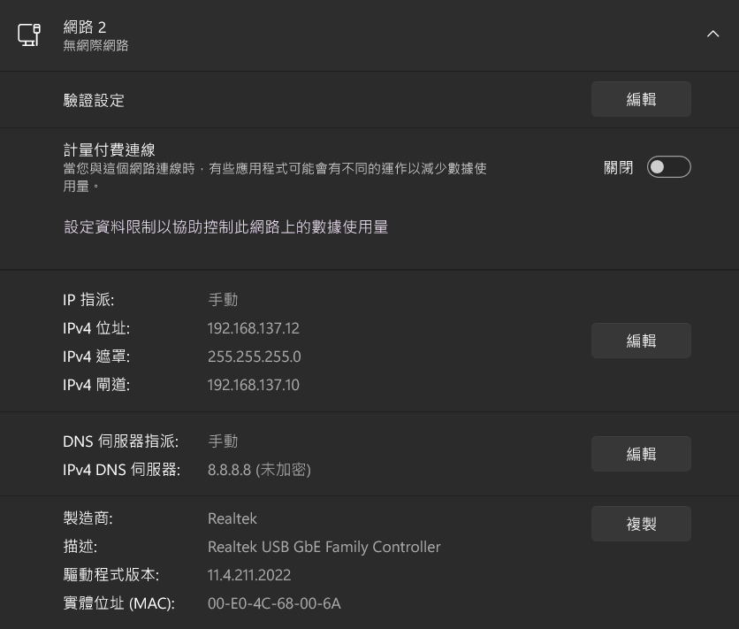
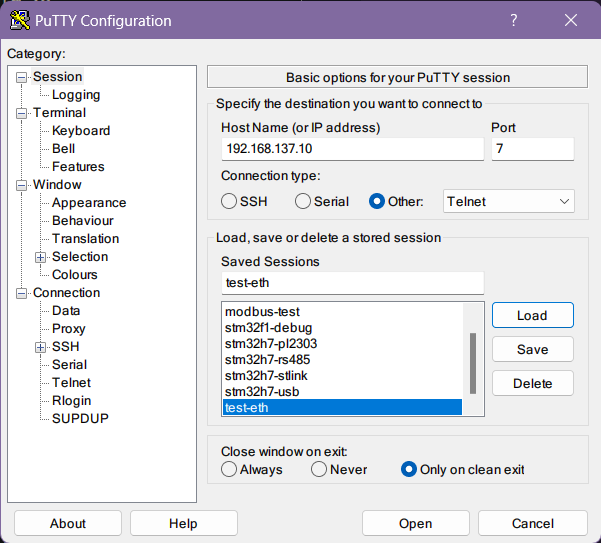
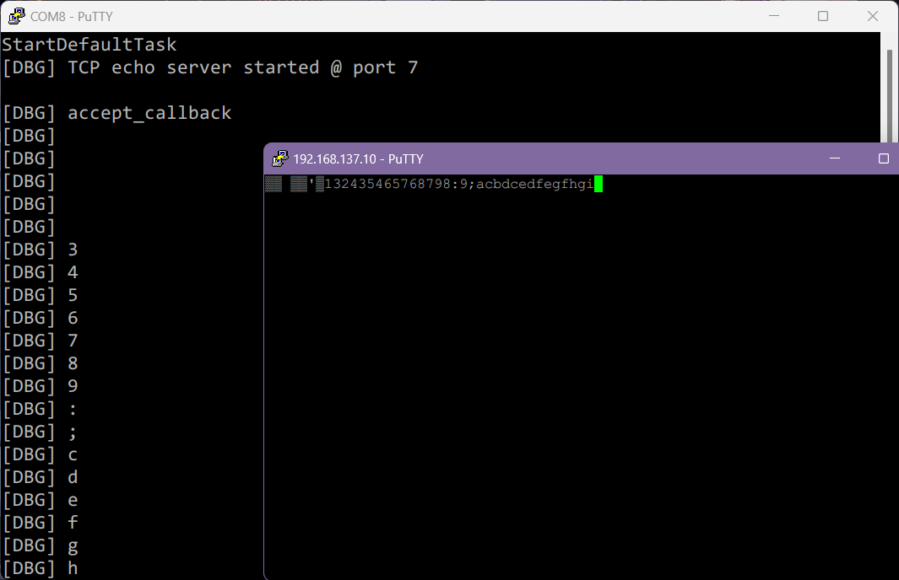

# NUCLEO-H755ZI-Q TCP Echo Server

## 步驟

1. 編譯專案 CM4 和 CM7，並下載這兩個程式到版子上
2. 設定 Windows 網路如下圖

Host IP: 192.168.137.12 
IP mask: 255.255.255.0 
IP gateway: 192.168.137.10 

3. PuTTY 上設定 telnet 如下圖

使用 telnet，IP:port 為 192.168.137.10:7

## 問題除錯

做完以上步驟，預期結果如下圖所示，COM8為 STlink 的 VCP (Virtual Com Port) 輸出，而 192.168.137.10 則是 telnet 視窗。

當使用者在 telnet 輸入一個字元後，板子會傳回此字元的 ascii code + 2 後的字元，例如輸入 'a' 會傳回 'c'，輸入 '1' 傳回 '3'，以此推類。

如果開啟 telnet 後沒有得到板子回傳的字元，開啟 VCP 看除錯輸出，如果沒有顯示 `[DBG] accept_callback`，表示 telnet 連線沒有成功。

先確認板子上的兩個 LED 都有在閃 (表示 CM4 和 CM7 都在運作中)，再用以下方法除錯

1. 重開機/重置板子
2. 確認 Windows 網路設定已變成 "無網際網路"

很有可能 telnet 連線後板子上綠色 LED 突然不亮，這也代表連線失敗，此時系統卡在 LwIP 的某個 semaphore 中，只能重啟。